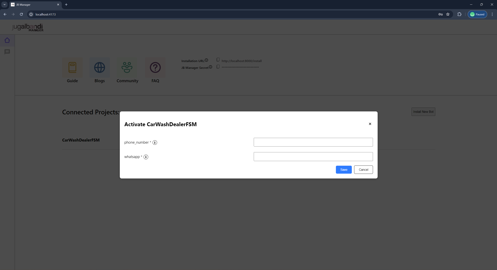

## Prerequisite 
1. **Docker** - Ensure that your system has docker engine installed and running. For installation, please refer to [docker engine installation instruction](https://docs.docker.com/engine/install/).
2. **WSL** - If you are using Windows, please ensure that WSL is enabled. For installation, please refer to [WSL installation instruction](https://docs.microsoft.com/en-us/windows/wsl/install).
3. **Docker Compose** - Ensure docker compose is enabled along with docker engine. Please refer to [docker compose installation instruction](https://docs.docker.com/compose/install/).
4. **NGROK** - NGROK is required to tunnel the Whatsapp callback URL to your local system. Please refer to [NGROK Quickstart Guide](https://ngrok.com/docs/getting-started/) for installation.
5. **Azure Storage** - JBManager depends on Azure blob storage for audio processing. For more details, please refer to Azure storage [setup instructions](../references/storage.md).
6. **Translation and Speech API** - JBManager uses speech processing API to handle audio and translation API to handle user input in various languages. Please refer to Translation and Speech API [setup guide](../references/speech-and-translation.md) for more details.
7. **Whatsapp Interface** - This quickstart will focus on setup your own through whatsapp as channel. Please refer to [channel setup guide](../references/whatsapp.md) for more details.

## Running JB Manager
1. Clone and Change the directory to the project root.
```bash
$ git clone git@github.com:OpenNyAI/Jugalbandi-Manager.git
$ cd Jugalbandi-Manager
```
2. Copy the contents of `.env-dev.template` file to `.env-dev` in the same directory.
```bash
$ cp .env-dev.template .env-dev
```
3. Update the values missing fields in the `.env-dev` file.
4. Generate an Encryption key using the following command 
```bash
$ dd if=/dev/urandom bs=32 count=1 2>/dev/null | openssl base64
``` 
and add it to `ENCRYPTION_KEY` in `.env-dev` file. 

Note: Remember to enclose value of `ENCRYPTION_KEY` within single quotes.

5. Start the `kafka` and `postgres` container.
```bash
$ bash scripts/run.sh kafka postgres
```

6. Start a new shell session and create the relevant postgres tables.
```bash
$ bash scripts/upgrade-db.sh
```

7. Create relevant kafka topics.
```bash
$ bash scripts/create-topic.sh channel
$ bash scripts/create-topic.sh flow
$ bash scripts/create-topic.sh language
```

8. Start JB Manager
```bash
$ bash scripts/run.sh --stage api channel language flow frontend
```

## Bot Installation and Go Live

1. Go to [JB Manager UI](http://localhost:4173) 

2. Click on install new bot and provide the required data to create your bot. 
The detailed information about the fields are given below:
    1. **Name [Mandatory]** is the name of the bot. It should be the name of class for your bot code mentioned below. For this example, use `CarWashDealerFSM`.
    2. **Code [Mandatory]** is the fsm.py file python code. Copy the contents of [python file](car_wash.py) and paste it.
    3. **version [Mandatory]** - version of the bot. Put `1.0.0`.
    4. **required_credentials [Mandatory]** - Credentials required by the bot to access various external services. Here the FSM depends on `AZURE_OPENAI_API_KEY`,`AZURE_OPENAI_API_VERSION`,`AZURE_OPENAI_API_ENDPOINT` so put these keys in this section seperated by comma.
    5. Click on `Install` button.
    
3. Once the bot is created, click on the **settings (⚙) icon** to enter the given credentials values and click save to save the credentials values. For this example, put the values of `AZURE_OPENAI_API_KEY`, `AZURE_OPENAI_API_VERSION` and `AZURE_OPENAI_API_ENDPOINT`. 

4. Then click on the **play (▶️) icon** to activate the bot by providing the whatsapp business phone number in `phone number` and whatsapp api key in the `whatsapp` field. 

5. Once the above steps are completed, the bot status will be changed from **inactive** to **active**.

6. Start a new shell session and start ngrok on your system 
    ```bash
    $ ngrok http 8000
    ```
7. Copy the tunnel url from the ngrok shell.

8. Add this url to register the callback URL for Whatsapp service provider. Your callback url will look like this `<Tunnel URL>/callback`. 

    For this tutorial, we are using the shell script to add the callback URL. Run the script on a new shell session with the appropriate values to register the callback URL.

    ```bash
    #!/bin/bash

    WEBHOOK_URL="<Webhook url here>"
    WA_API_HOST="<API host here>"
    WABA_NUMBER="<Whatsapp business account number>"
    WA_API_KEY="<API Key here>"

    BODY='{"webhook_url": "'$WEBHOOK_URL'"}'
    echo $BODY

    curl -k "$WA_API_HOST/v1/setwebhooks" \
    --header "wanumber: $WABA_NUMBER" \
    --header "apikey: $WA_API_KEY" \
    --header 'Content-Type: application/json' \
    --data-raw "$BODY"
    ```
9. Your bot is running. Send a `Hi` message to whatsapp business number to start conversation with the bot.